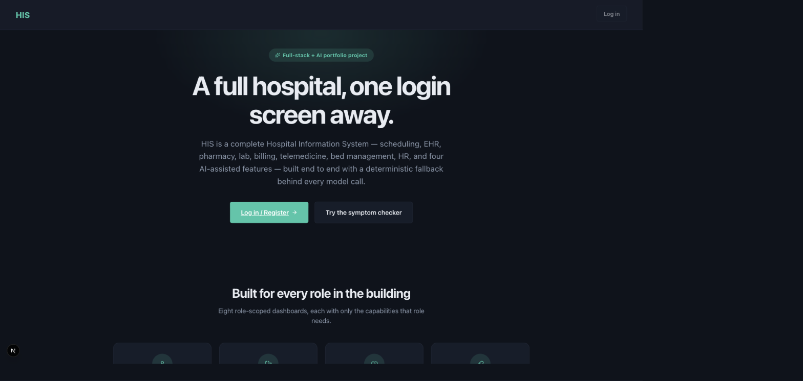
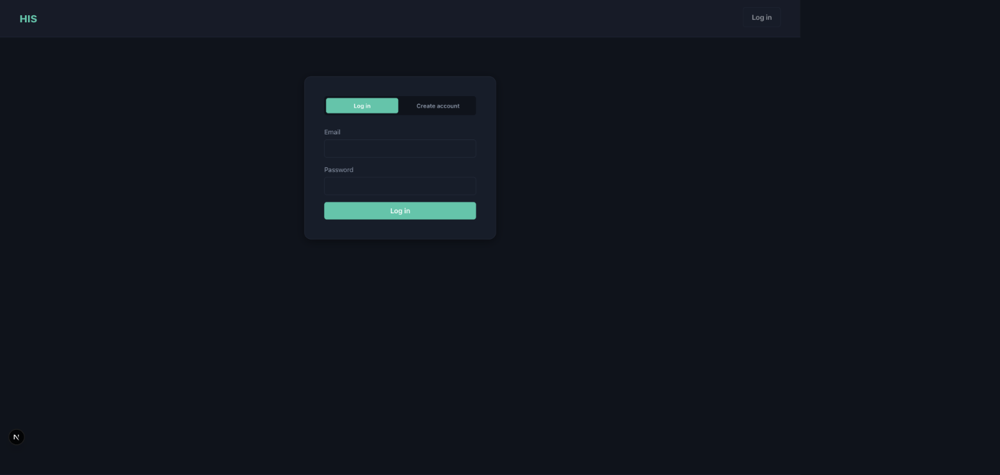
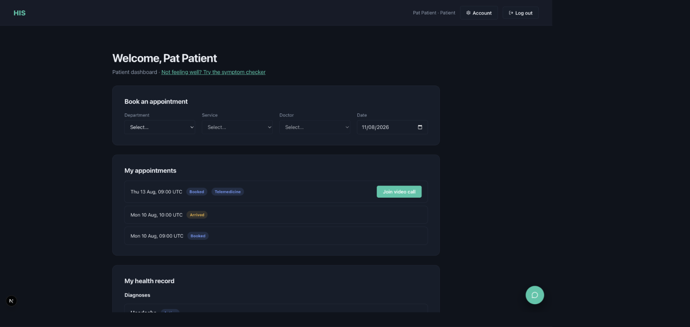
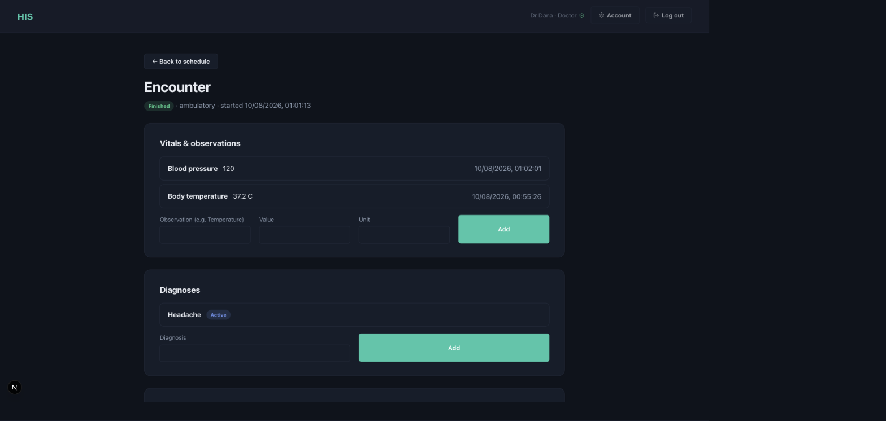
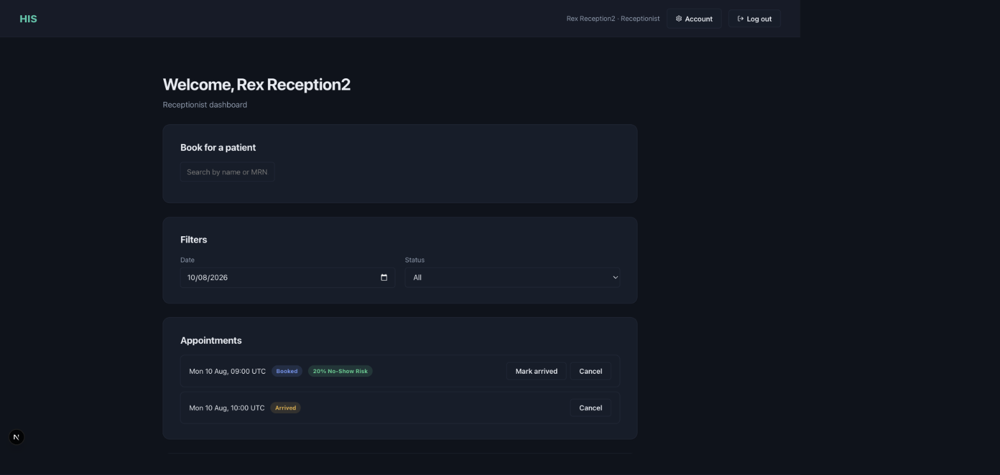
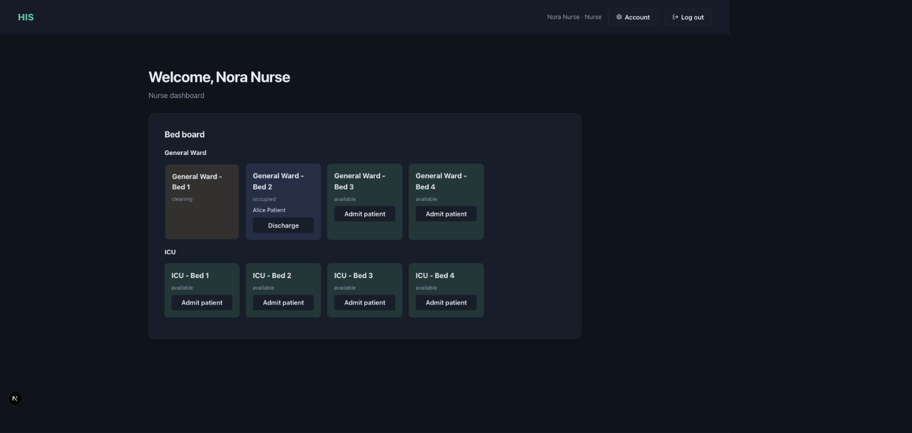
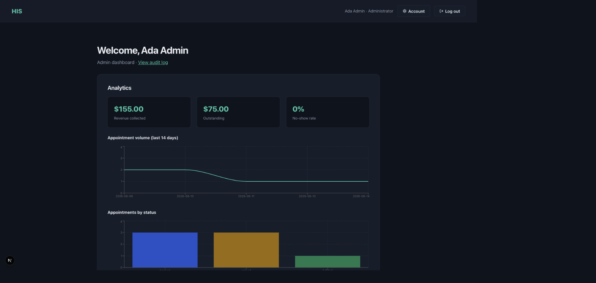
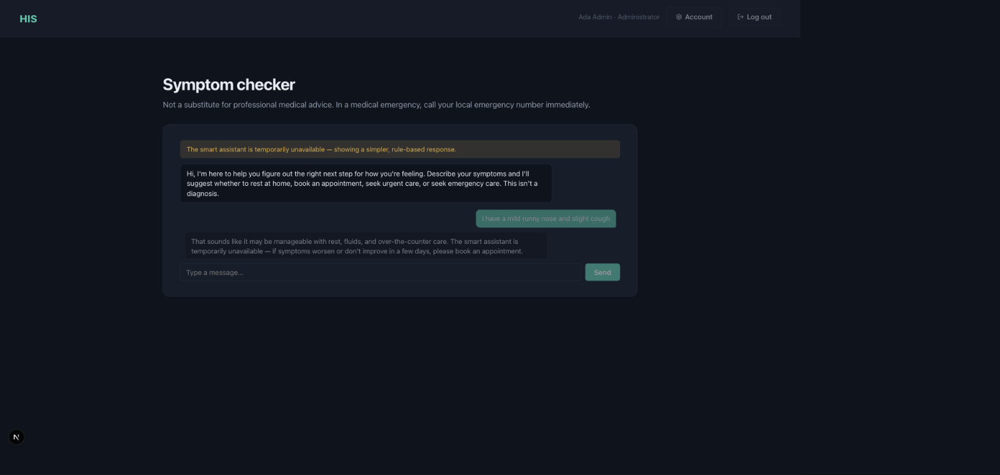

# HIS — Hospital Information System (portfolio project)

**Live:** [frontend](https://his-frontend-nine.vercel.app) ·
[backend](https://his-backend-nine.vercel.app/health) — deployed on Vercel, connected
(`NEXT_PUBLIC_API_URL` wired and baked into the deployed frontend bundle), and verified with
a real end-to-end registration request against the live Neon Postgres database. The ML
no-show-prediction service and MinIO object storage referenced in `docker-compose.yml`
aren't wired into the deployed backend — the code never actually called MinIO, and the
no-show ML service is a single optional feature, not required for the rest of the app.

A full-stack + AI Hospital Information System: patient registration, multi-doctor
scheduling, EHR, pharmacy, lab, billing, HR, bed/ward management, ambulance
dispatch, telemedicine, and four AI features (triage chatbot, booking concierge,
no-show prediction, clinical documentation assistant) — each with a deterministic
fallback when the LLM/ML service is unavailable.

This is a learning/portfolio build. Security and compliance controls (encryption,
audit logging, RBAC, MFA, consent tracking) are implemented to **demonstrate** a
HIPAA-conscious posture — see `docs/compliance-checklist.md` — but this system has
not been certified or audited and must not be used with real patient data.

## Screenshots

| | |
|---|---|
| **Landing page**  | **Login**  |
| **Patient dashboard**  | **Doctor — encounter chart**  |
| **Receptionist — scheduling & dispatch**  | **Nurse — live bed board**  |
| **Admin — analytics**  | **AI symptom checker**  |

## Stack

- **backend/** — Node 20, Express, TypeScript (ESM), Postgres (`pg`), Redis
  (`ioredis`), Socket.io, `node-pg-migrate` for schema migrations, JWT auth with
  TOTP MFA, `@anthropic-ai/sdk` + `@langchain/langgraph` for AI features.
- **frontend/** — Next.js (App Router), React, TypeScript, `@tanstack/react-query`.
- **ml-service/** — Python, FastAPI, scikit-learn (no-show prediction).
- **Infra** — Postgres, Redis, MinIO (S3-compatible object storage), Mailpit (dev
  SMTP catcher), all via Docker Compose.

## Running locally

```bash
cp .env.example .env   # edit secrets if you want, dev defaults work as-is
docker compose up --build
```

- Frontend: http://localhost:3000
- Backend API: http://localhost:4001 (container's internal port is 4000; remapped
  on the host since an unrelated local process was already using 4000)
- Mailpit (sent email): http://localhost:8025
- MinIO console: http://localhost:9001
- ml-service: http://localhost:8000/health

Database migrations run automatically before the backend starts (see
`backend/package.json`'s `predev` script).

## Build phases

See `docs/roadmap.md` for the phased build plan — all six phases are complete;
each phase is independently demoable.

## Roles

`patient`, `doctor`, `nurse`, `pharmacist`, `lab_tech`, `receptionist`,
`billing_clerk`, `admin` — see `backend/src/modules/identity/permissions.ts` for
the capability model.
